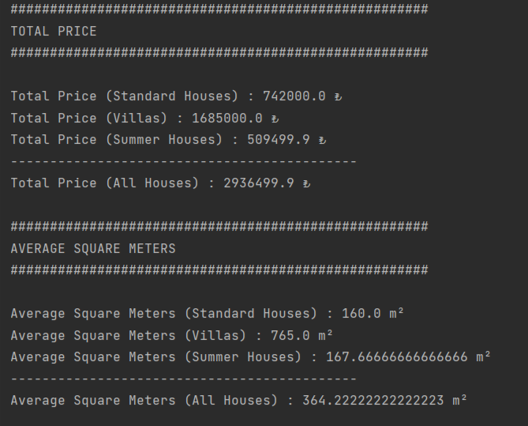
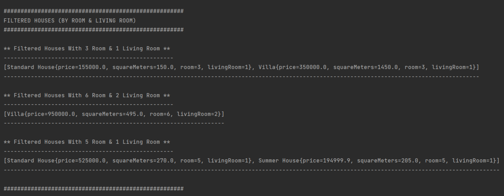

# House Types Application

This Project is about calculating total prices, average square meters for house types and filtering houses by room & living room.

# Screenshots

After run Main, console looks like this.

### Total Price & Average Square Meters

### Filtered Houses

## More Information

I created "HouseListRepo" *class* inside the "data" *package*.
This *class* contains Lists of the different types of houses in memory.
Service *class* calls it and does operations with houses in the List which comes from HouseListRepo.

I used singleton pattern for service and data because only one instance will be enough.